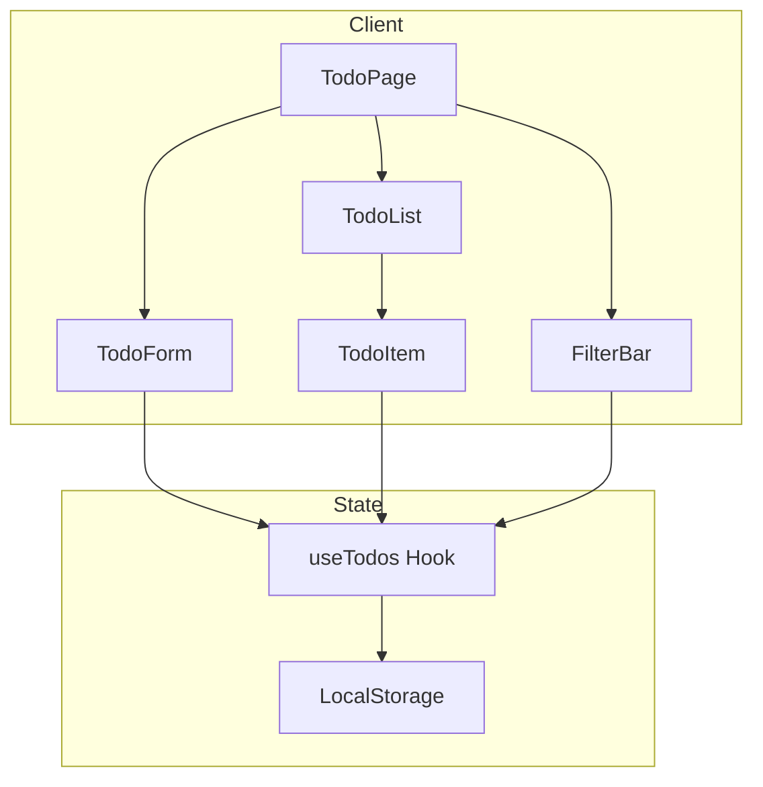
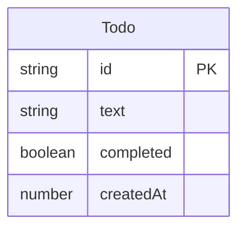

# 設計ドキュメント: おしゃれなTODOアプリ

## 概要

**目的**: ユーザーに視覚的に美しく、使いやすいタスク管理体験を提供する。

**ユーザー**: 日常のタスク管理をシンプルかつ楽しく行いたい個人ユーザー。

**影響**: 新規開発（グリーンフィールド）。既存システムへの影響なし。

### ゴール
- モダンで洗練されたUIでタスク管理を実現
- スムーズなアニメーションで快適なUX
- ローカルストレージによるデータ永続化
- レスポンシブデザインで多様なデバイスに対応

### 非ゴール
- ユーザー認証・マルチユーザー対応
- サーバーサイドデータ同期
- タスクのカテゴリ・タグ機能
- リマインダー・通知機能

## アーキテクチャ

### アーキテクチャパターン＆境界マップ



**アーキテクチャ統合**:
- 選択パターン: **コンポーネント + カスタムフック** — シンプルなクライアントサイドアプリに最適
- ドメイン境界: UIコンポーネント層とステート管理層を分離
- 新コンポーネントの理由: 各UIコンポーネントは単一責任、フックがビジネスロジックを集約

### 技術スタック

| レイヤー | 選択 / バージョン | 機能での役割 | 備考 |
|---------|-----------------|-------------|------|
| フロントエンド | Next.js 16 / React 19 | App Router、Server Components | 最新の安定版 |
| スタイリング | Tailwind CSS 4 | ユーティリティファーストCSS | アニメーションにCSS Transitions使用 |
| 状態管理 | React useState + カスタムフック | タスク状態の管理 | 外部ライブラリ不要 |
| データ | LocalStorage | クライアントサイド永続化 | JSON形式で保存 |
| 型安全 | TypeScript 5 (strict) | 型定義 | `any` 使用禁止 |

## 要件トレーサビリティ

| 要件 | 概要 | コンポーネント | インターフェース |
|------|------|--------------|----------------|
| 1.1-1.5 | タスク管理（CRUD） | TodoForm, TodoItem, useTodos | TodoService |
| 2.1-2.5 | 表示・フィルタリング | TodoList, FilterBar, useTodos | FilterType |
| 3.1-3.3 | データ永続化 | useTodos | StorageService |
| 4.1-4.6 | おしゃれなUI/UX | 全UIコンポーネント | CSS Animations |
| 5.1-5.2 | 一括操作 | FilterBar, useTodos | TodoService |

## コンポーネントとインターフェース

### コンポーネント概要

| コンポーネント | レイヤー | 意図 | 要件カバレッジ | 主要な依存関係 | 契約 |
|--------------|--------|------|--------------|--------------|------|
| TodoPage | UI | メインページレイアウト | 全要件 | useTodos (P0) | - |
| TodoForm | UI | タスク追加フォーム | 1.1, 1.5 | useTodos (P0) | - |
| TodoList | UI | タスクリスト表示 | 2.1 | useTodos (P0) | - |
| TodoItem | UI | 個別タスク表示・操作 | 1.2-1.4, 4.3-4.4 | useTodos (P0) | - |
| FilterBar | UI | フィルター・一括操作 | 2.2-2.5, 5.1-5.2 | useTodos (P0) | - |
| useTodos | State | タスク状態管理 | 全要件 | LocalStorage (P0) | Service, State |

### State Layer

#### useTodos Hook

| フィールド | 詳細 |
|----------|------|
| 意図 | タスクのCRUD操作とフィルタリングロジックを提供 |
| 要件 | 1.1-1.5, 2.1-2.5, 3.1-3.3, 5.1-5.2 |

**責任と制約**
- タスクの追加、編集、削除、完了切り替え
- フィルター状態の管理
- LocalStorageとの同期
- 初回マウント時のデータ復元

**依存関係**
- アウトバウンド: LocalStorage — データ永続化 (P0)

**契約**: Service [x] / State [x]

##### サービスインターフェース

```typescript
interface Todo {
  id: string;
  text: string;
  completed: boolean;
  createdAt: number;
}

type FilterType = 'all' | 'active' | 'completed';

interface UseTodosReturn {
  todos: Todo[];
  filteredTodos: Todo[];
  filter: FilterType;
  activeCount: number;
  completedCount: number;
  addTodo: (text: string) => void;
  toggleTodo: (id: string) => void;
  deleteTodo: (id: string) => void;
  editTodo: (id: string, text: string) => void;
  setFilter: (filter: FilterType) => void;
  clearCompleted: () => void;
}
```

- 事前条件: `text` は空文字列でないこと（addTodo時）
- 事後条件: 操作後、LocalStorageに自動保存
- 不変条件: `id` は一意、`todos` は常に配列

##### 状態管理

- 状態モデル: `todos: Todo[]`, `filter: FilterType`
- 永続化: LocalStorage（キー: `todos`）、JSON形式
- 並行性: シングルスレッド（クライアントサイド）

### UI Layer

#### TodoForm

| フィールド | 詳細 |
|----------|------|
| 意図 | 新規タスクの入力と追加 |
| 要件 | 1.1, 1.5 |

**実装ノート**
- Enter キーまたはボタンクリックで送信
- 空入力時はエラー表示（追加しない）
- 送信後は入力フィールドをクリア

#### TodoItem

| フィールド | 詳細 |
|----------|------|
| 意図 | 個別タスクの表示と操作 |
| 要件 | 1.2-1.4, 4.3-4.4 |

**実装ノート**
- チェックボックスで完了切り替え
- ダブルクリックで編集モード
- 削除ボタンはホバー時に表示
- 完了時は取り消し線 + フェードアニメーション

#### FilterBar

| フィールド | 詳細 |
|----------|------|
| 意図 | フィルター選択と一括操作 |
| 要件 | 2.2-2.5, 5.1-5.2 |

**実装ノート**
- 3つのフィルターボタン（すべて/未完了/完了済み）
- 未完了タスク数の表示
- 完了済みタスクがある場合のみ「完了済みを削除」ボタン表示

## データモデル

### ドメインモデル



**エンティティ: Todo**
- `id`: UUID形式の一意識別子
- `text`: タスクの内容（1文字以上）
- `completed`: 完了状態
- `createdAt`: 作成日時（Unix timestamp）

**不変条件**
- `id` は作成後に変更不可
- `text` は空文字列不可

### 論理データモデル

**ストレージ構造** (LocalStorage):
```json
{
  "todos": [
    {
      "id": "uuid-1",
      "text": "タスク内容",
      "completed": false,
      "createdAt": 1733580000000
    }
  ]
}
```

## エラーハンドリング

### エラーカテゴリとレスポンス

**ユーザーエラー**:
- 空のタスク入力 → 入力フィールドにエラー表示、追加を拒否

**システムエラー**:
- LocalStorage アクセス失敗 → コンソール警告、メモリ内動作を継続

## テスト戦略

### ユニットテスト
- `useTodos`: タスク追加、削除、編集、フィルタリングのロジック
- 空入力バリデーション
- LocalStorage 読み書き

### E2Eテスト
- タスク追加 → 表示確認
- タスク完了 → フィルター動作確認
- ページリロード → データ復元確認

## パフォーマンス考慮事項

- **アニメーション**: CSS Transitionsを使用（JS不要）
- **再レンダリング**: `useMemo` / `useCallback` で最適化
- **LocalStorage**: 変更時のみ書き込み（デバウンス不要、同期的）

