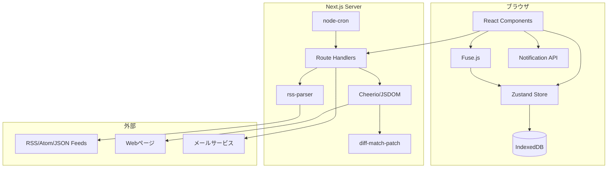
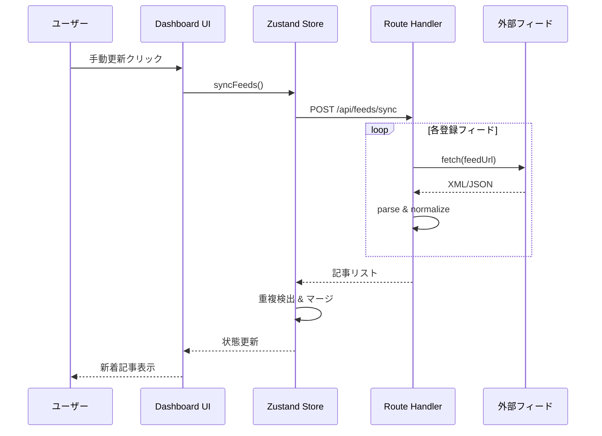
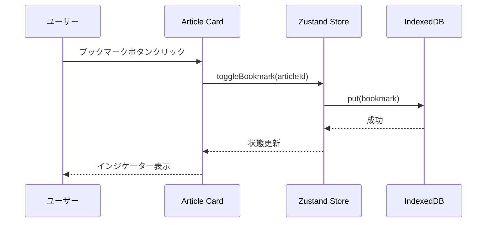
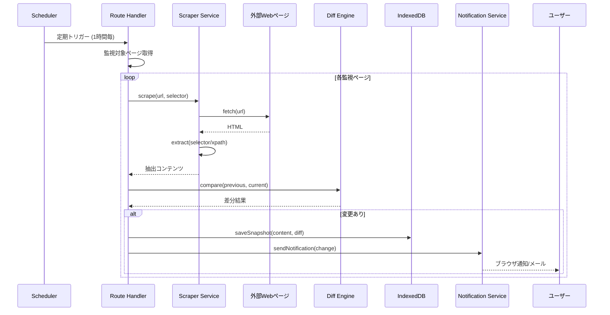
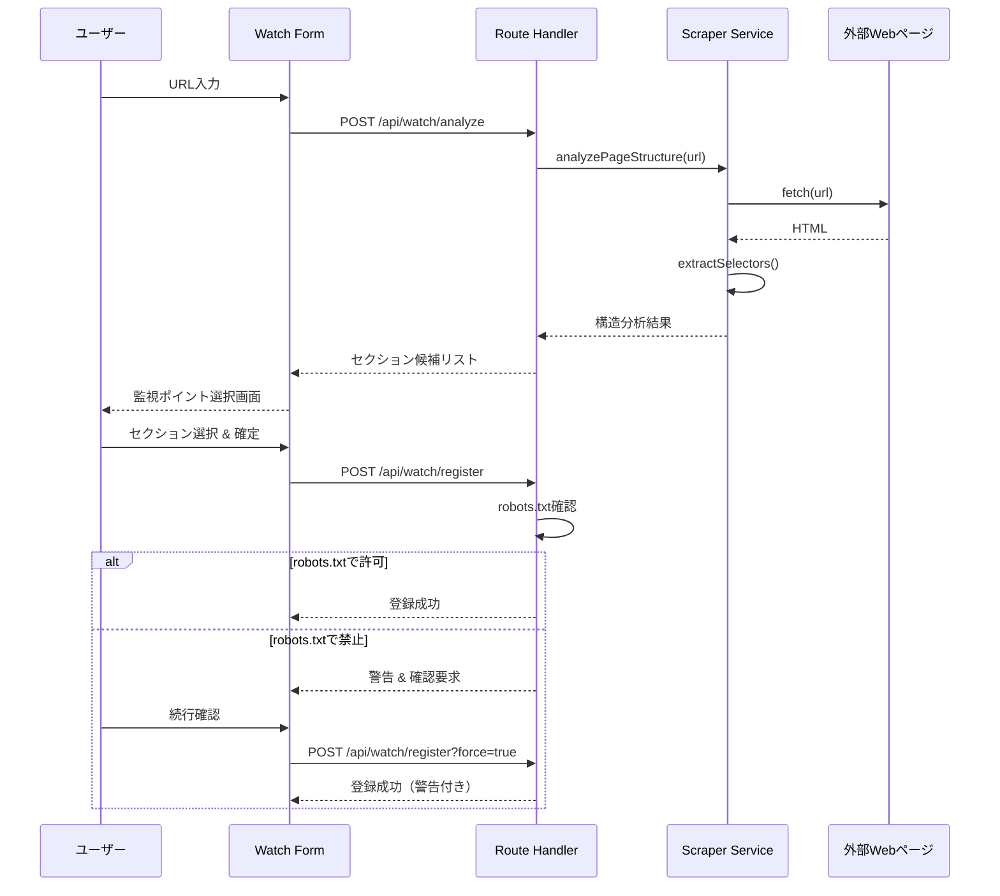
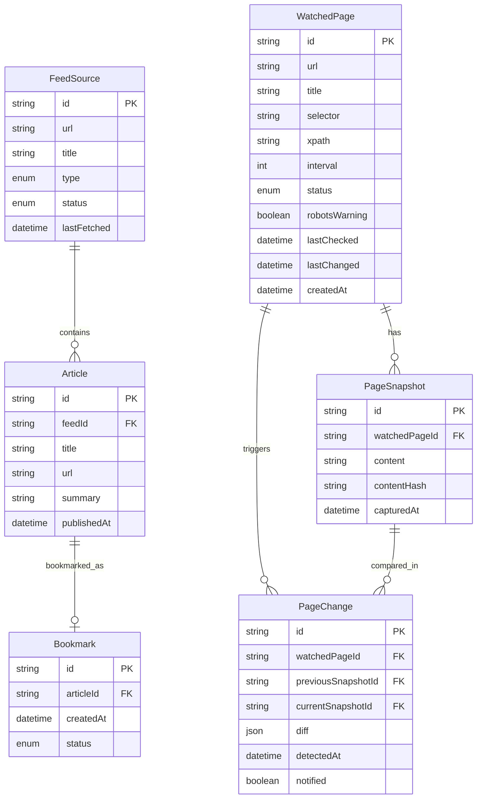

# 設計ドキュメント: Tech Info Dashboard

## 概要

**目的**: 開発者・エンジニアに対し、複数の技術情報ソースを一元管理し、最新トレンドを効率的にキャッチアップできる価値を提供する。

**ユーザー**: 技術情報を日常的に収集する開発者が、朝のルーティンや情報収集タスクでこれを利用する。

**影響**: 新規アプリケーションとして構築。既存システムへの影響なし。

### ゴール
- 複数フィード形式（RSS/Atom/JSON Feed）の統一的な管理
- 自動・手動同期による最新情報の取得
- **Webページの変更検知とスクレイピング**
- 直感的で美しいダッシュボードUI
- 高速なフィルタリングと検索
- オフラインでも利用可能なブックマーク機能
- **変更通知（ブラウザ/メール）**

### 非ゴール
- ユーザー認証・マルチユーザー対応（初期バージョン）
- サーバーサイドでのデータ永続化
- AIによる記事要約・レコメンデーション
- モバイルネイティブアプリ

## アーキテクチャ

> 詳細な調査ノートは `research.md` を参照。

### アーキテクチャパターン＆境界マップ



**アーキテクチャ統合**:
- **選択パターン**: レイヤードアーキテクチャ（UI → State → Persistence）+ BFF（Backend for Frontend）
- **ドメイン境界**: フィード取得（Server）、スクレイピング（Server）、データ管理（Client Store）、表示（UI Components）
- **新コンポーネントの理由**: フィード取得・スクレイピングはCORS回避のためServer必須、クライアント側は単一責任で分離

### 技術スタック

| レイヤー | 選択 / バージョン | 機能での役割 | 備考 |
|---------|-----------------|-------------|------|
| フロントエンド | Next.js 14 + React 18 | App Router、SSR/CSR | Server Components活用 |
| UIライブラリ | shadcn/ui + Radix UI | アクセシブルなコンポーネント | カスタマイズ可能 |
| スタイリング | Tailwind CSS 3 | ユーティリティファーストCSS | レスポンシブ対応 |
| 状態管理 | Zustand 4 | グローバル状態 | 永続化ミドルウェア |
| データ永続化 | Dexie.js (IndexedDB) | 記事キャッシュ | オフライン対応 |
| 検索 | Fuse.js | あいまい全文検索 | クライアントサイド |
| フィードパース | rss-parser | RSS/Atom解析 | サーバーサイドのみ |
| **スクレイピング** | Cheerio + JSDOM | HTML解析・DOM操作 | サーバーサイドのみ |
| **差分検出** | diff-match-patch | テキスト差分計算 | 変更ハイライト |
| **スケジューラ** | node-cron | 定期実行 | スクレイピング間隔 |
| **通知** | Web Push API / Resend | ブラウザ・メール通知 | オプション機能 |

## システムフロー

### フィード同期フロー



### ブックマーク操作フロー



### Webスクレイピング・変更検知フロー



### 監視ページ登録フロー



## 要件トレーサビリティ

| 要件 | 概要 | コンポーネント | インターフェース | フロー |
|------|------|--------------|----------------|--------|
| 1.1-1.5 | データソース管理 | FeedManager, FeedForm | FeedService | - |
| 2.1-2.5 | 情報収集・同期 | SyncManager | SyncService | フィード同期 |
| 3.1-3.5 | ダッシュボード表示 | ArticleList, ArticleCard | - | - |
| 4.1-4.5 | フィルタリング・検索 | SearchBar, FilterPanel | SearchService | - |
| 5.1-5.5 | ブックマーク | BookmarkButton, BookmarkList | BookmarkService | ブックマーク操作 |
| 6.1-6.5 | パーソナライゼーション | SettingsPanel, ThemeProvider | SettingsService | - |
| **7.1-7.7** | **Webスクレイピング・変更検知** | **WatchManager, WatchForm, DiffViewer** | **ScrapingService, NotificationService** | **スクレイピング, 監視登録** |

## コンポーネントとインターフェース

### コンポーネント概要

| コンポーネント | ドメイン | 意図 | 要件 | 主要な依存関係 | 契約 |
|--------------|---------|------|------|--------------|------|
| FeedService | Data | フィード取得・パース | 1.1-1.5, 2.1-2.5 | rss-parser (P0) | Service |
| **ScrapingService** | Data | Webページスクレイピング・差分検出 | 7.1-7.6 | Cheerio (P0), diff-match-patch (P0) | Service |
| **NotificationService** | Data | 通知送信（ブラウザ・メール） | 7.3, 7.7 | Web Push API (P0), Resend (P1) | Service |
| ArticleStore | State | 記事状態管理 | 3.1-3.5 | Zustand (P0), Dexie (P0) | State |
| **WatchStore** | State | 監視ページ状態管理 | 7.1-7.4 | Zustand (P0), Dexie (P0) | State |
| SearchService | Logic | 全文検索実行 | 4.1-4.5 | Fuse.js (P0) | Service |
| BookmarkService | Data | ブックマーク永続化 | 5.1-5.5 | Dexie (P0) | Service |
| SettingsService | Data | 設定永続化 | 6.1-6.5 | localStorage (P0) | Service |
| Dashboard | UI | メインレイアウト | 3.1-3.5 | ArticleStore (P0) | - |
| ArticleCard | UI | 記事表示 | 3.2-3.3 | - | - |
| **WatchManager** | UI | 監視ページ管理画面 | 7.1-7.6 | WatchStore (P0) | - |
| **DiffViewer** | UI | 変更差分表示 | 7.4 | - | - |

### Data Layer

#### FeedService

| フィールド | 詳細 |
|----------|------|
| 意図 | 外部フィードの取得・パース・正規化 |
| 要件 | 1.1, 1.4, 1.5, 2.1, 2.3, 2.4 |

**責任と制約**
- RSS 2.0、Atom、JSON Feedの取得とパース
- フィードURLの検証とエラーハンドリング
- 記事データの正規化（共通フォーマットへ変換）

**依存関係**
- 外部: rss-parser — フィードパース (P0)
- 外部: 各フィードURL — データソース (P0)

**契約**: Service [x]

##### サービスインターフェース

```typescript
interface FeedSource {
  id: string;
  url: string;
  title: string;
  type: 'rss' | 'atom' | 'json';
  status: 'active' | 'error' | 'paused';
  lastFetched: Date | null;
  errorMessage?: string;
}

interface Article {
  id: string;
  feedId: string;
  title: string;
  url: string;
  summary: string;
  content?: string;
  author?: string;
  publishedAt: Date;
  fetchedAt: Date;
  imageUrl?: string;
  categories: string[];
}

interface FeedService {
  detectFeedType(url: string): Promise<Result<FeedSource['type'], FeedError>>;
  fetchFeed(source: FeedSource): Promise<Result<Article[], FeedError>>;
  validateUrl(url: string): Promise<Result<boolean, FeedError>>;
}

type FeedError = 
  | { type: 'INVALID_URL'; message: string }
  | { type: 'FETCH_FAILED'; message: string; statusCode?: number }
  | { type: 'PARSE_ERROR'; message: string }
  | { type: 'UNSUPPORTED_FORMAT'; message: string };
```

- 事前条件: URLは有効な形式
- 事後条件: 正規化されたArticle配列を返却
- 不変条件: 同一URLからは同一形式のデータを返却

#### ScrapingService（新規）

| フィールド | 詳細 |
|----------|------|
| 意図 | Webページのスクレイピング、構造解析、差分検出 |
| 要件 | 7.1, 7.2, 7.3, 7.4, 7.5, 7.6 |

**責任と制約**
- Webページの取得とDOM解析
- CSSセレクタ/XPathによるコンテンツ抽出
- 前回スナップショットとの差分検出
- robots.txtの確認と警告
- ページ構造の自動解析（監視ポイント候補の提案）

**依存関係**
- 外部: Cheerio — HTML解析 (P0)
- 外部: JSDOM — DOM操作 (P1)
- 外部: diff-match-patch — 差分計算 (P0)
- 外部: robots-parser — robots.txt解析 (P0)

**契約**: Service [x]

##### サービスインターフェース

```typescript
interface WatchedPage {
  id: string;
  url: string;
  title: string;
  selector: string | null; // nullは全体監視
  xpath: string | null;
  interval: number; // 分単位、デフォルト60
  status: 'active' | 'paused' | 'error';
  lastChecked: Date | null;
  lastChanged: Date | null;
  robotsWarning: boolean; // robots.txtで禁止されている場合true
  createdAt: Date;
}

interface PageSnapshot {
  id: string;
  watchedPageId: string;
  content: string;
  contentHash: string;
  capturedAt: Date;
}

interface PageChange {
  id: string;
  watchedPageId: string;
  previousSnapshotId: string;
  currentSnapshotId: string;
  diff: DiffResult[];
  detectedAt: Date;
  notified: boolean;
}

interface DiffResult {
  type: 'added' | 'removed' | 'unchanged';
  value: string;
}

interface PageStructure {
  title: string;
  sections: {
    selector: string;
    xpath: string;
    label: string; // 推測されたセクション名
    preview: string; // 先頭100文字程度
  }[];
}

interface ScrapingService {
  // ページ解析
  analyzePageStructure(url: string): Promise<Result<PageStructure, ScrapingError>>;
  
  // スクレイピング実行
  scrape(page: WatchedPage): Promise<Result<string, ScrapingError>>;
  
  // 差分検出
  compareSnapshots(previous: string, current: string): DiffResult[];
  
  // robots.txt確認
  checkRobotsTxt(url: string): Promise<{ allowed: boolean; directive?: string }>;
  
  // 定期実行
  scheduleCheck(page: WatchedPage): void;
  cancelSchedule(pageId: string): void;
}

type ScrapingError =
  | { type: 'FETCH_FAILED'; message: string; statusCode?: number }
  | { type: 'SELECTOR_NOT_FOUND'; message: string }
  | { type: 'PARSE_ERROR'; message: string }
  | { type: 'ROBOTS_BLOCKED'; message: string };
```

- 事前条件: URLは有効なHTTPスキーム
- 事後条件: 抽出されたテキストコンテンツを返却
- 不変条件: 同一セレクタで同一構造のデータを返却

#### NotificationService（新規）

| フィールド | 詳細 |
|----------|------|
| 意図 | 変更検知時の通知送信 |
| 要件 | 7.3, 7.7 |

**責任と制約**
- ブラウザプッシュ通知の送信
- メール通知の送信（オプション）
- 通知設定の管理

**依存関係**
- 外部: Web Push API — ブラウザ通知 (P0)
- 外部: Resend — メール送信 (P1、オプション)

**契約**: Service [x]

##### サービスインターフェース

```typescript
interface NotificationSettings {
  browserEnabled: boolean;
  emailEnabled: boolean;
  email?: string;
  quietHours?: { start: number; end: number }; // 24時間表記
}

interface NotificationPayload {
  title: string;
  body: string;
  url: string;
  pageId: string;
  changeId: string;
}

interface NotificationService {
  // ブラウザ通知
  requestPermission(): Promise<NotificationPermission>;
  sendBrowserNotification(payload: NotificationPayload): Promise<Result<void, NotificationError>>;
  
  // メール通知
  sendEmailNotification(email: string, payload: NotificationPayload): Promise<Result<void, NotificationError>>;
  
  // 設定
  getSettings(): NotificationSettings;
  updateSettings(settings: Partial<NotificationSettings>): void;
}

type NotificationError =
  | { type: 'PERMISSION_DENIED'; message: string }
  | { type: 'SEND_FAILED'; message: string }
  | { type: 'INVALID_EMAIL'; message: string };
```

#### BookmarkService

| フィールド | 詳細 |
|----------|------|
| 意図 | ブックマークのCRUD操作とIndexedDB永続化 |
| 要件 | 5.1, 5.2, 5.3, 5.4, 5.5 |

**責任と制約**
- ブックマークの追加・削除・一覧取得
- IndexedDBへの永続化
- 元記事削除時のステータス管理

**依存関係**
- 外部: Dexie.js — IndexedDBラッパー (P0)

**契約**: Service [x] / State [x]

##### サービスインターフェース

```typescript
interface Bookmark {
  id: string;
  articleId: string;
  article: Article;
  createdAt: Date;
  status: 'active' | 'source_deleted';
}

interface BookmarkService {
  add(article: Article): Promise<Result<Bookmark, BookmarkError>>;
  remove(bookmarkId: string): Promise<Result<void, BookmarkError>>;
  getAll(): Promise<Result<Bookmark[], BookmarkError>>;
  isBookmarked(articleId: string): Promise<boolean>;
  updateStatus(bookmarkId: string, status: Bookmark['status']): Promise<Result<void, BookmarkError>>;
}

type BookmarkError =
  | { type: 'STORAGE_ERROR'; message: string }
  | { type: 'NOT_FOUND'; message: string };
```

#### SearchService

| フィールド | 詳細 |
|----------|------|
| 意図 | 記事の全文あいまい検索 |
| 要件 | 4.1, 4.5 |

**責任と制約**
- タイトルと本文からのキーワード検索
- あいまいマッチングによる関連記事の発見

**依存関係**
- 外部: Fuse.js — あいまい検索エンジン (P0)
- インバウンド: ArticleStore — 検索対象データ (P0)

**契約**: Service [x]

##### サービスインターフェース

```typescript
interface SearchOptions {
  keys: ('title' | 'summary' | 'content')[];
  threshold?: number; // 0.0-1.0, default 0.3
  limit?: number;
}

interface SearchResult {
  article: Article;
  score: number;
  matches: { key: string; indices: [number, number][] }[];
}

interface SearchService {
  search(query: string, articles: Article[], options?: SearchOptions): SearchResult[];
  buildIndex(articles: Article[]): void;
}
```

### State Layer

#### ArticleStore

| フィールド | 詳細 |
|----------|------|
| 意図 | 記事・フィード・フィルタ状態の一元管理 |
| 要件 | 2.2, 2.5, 3.1, 3.4, 4.2, 4.3, 4.4 |

**責任と制約**
- 記事リストの管理と重複検出
- フィルタ・ソート状態の管理
- IndexedDBとの同期

**依存関係**
- 外部: Zustand — 状態管理 (P0)
- 外部: Dexie.js — 永続化 (P0)

**契約**: State [x]

##### 状態管理

```typescript
interface FilterState {
  searchQuery: string;
  selectedFeeds: string[];
  selectedCategories: string[];
  dateRange: { start: Date | null; end: Date | null };
}

interface ArticleState {
  articles: Article[];
  feeds: FeedSource[];
  filters: FilterState;
  isLoading: boolean;
  lastSyncAt: Date | null;
}

interface ArticleActions {
  setArticles(articles: Article[]): void;
  addFeed(feed: FeedSource): void;
  removeFeed(feedId: string): void;
  updateFilters(filters: Partial<FilterState>): void;
  syncFeeds(): Promise<void>;
  getFilteredArticles(): Article[];
}

type ArticleStore = ArticleState & ArticleActions;
```

- 永続化: articles, feedsはIndexedDBに自動同期
- 並行性: 楽観的更新、競合時は最新データで上書き

#### WatchStore（新規）

| フィールド | 詳細 |
|----------|------|
| 意図 | 監視ページ・スナップショット・変更履歴の状態管理 |
| 要件 | 7.1, 7.2, 7.3, 7.4 |

**責任と制約**
- 監視ページリストの管理
- スナップショット履歴の保持
- 変更通知の管理
- IndexedDBとの同期

**依存関係**
- 外部: Zustand — 状態管理 (P0)
- 外部: Dexie.js — 永続化 (P0)

**契約**: State [x]

##### 状態管理

```typescript
interface WatchState {
  watchedPages: WatchedPage[];
  snapshots: Map<string, PageSnapshot[]>; // pageId -> snapshots
  changes: PageChange[];
  unreadChangeCount: number;
  isLoading: boolean;
}

interface WatchActions {
  addWatchedPage(page: Omit<WatchedPage, 'id' | 'createdAt'>): Promise<WatchedPage>;
  removeWatchedPage(pageId: string): Promise<void>;
  updateWatchedPage(pageId: string, updates: Partial<WatchedPage>): Promise<void>;
  pauseWatch(pageId: string): void;
  resumeWatch(pageId: string): void;
  
  addSnapshot(snapshot: PageSnapshot): void;
  getSnapshots(pageId: string): PageSnapshot[];
  
  addChange(change: PageChange): void;
  markChangeAsRead(changeId: string): void;
  markAllChangesAsRead(): void;
  getUnreadChanges(): PageChange[];
}

type WatchStore = WatchState & WatchActions;
```

- 永続化: watchedPages, snapshots, changesはIndexedDBに自動同期
- スナップショット保持: 直近10件まで保持、古いものは自動削除

#### SettingsService

| フィールド | 詳細 |
|----------|------|
| 意図 | ユーザー設定の管理と永続化 |
| 要件 | 6.1, 6.2, 6.3, 6.5 |

**契約**: Service [x] / State [x]

```typescript
interface Settings {
  theme: 'light' | 'dark' | 'system';
  layout: 'card' | 'list' | 'compact';
  syncInterval: number; // minutes
  priorityFeeds: string[];
  // 通知設定（要件7対応）
  notifications: NotificationSettings;
}

interface SettingsService {
  get(): Settings;
  update(settings: Partial<Settings>): void;
  reset(): void;
}
```

- 永続化: localStorage

### UI Layer

#### Dashboard（サマリーのみ）
- メインレイアウト、ヘッダー・サイドバー・コンテンツエリアの構成
- ArticleStoreからデータを購読し子コンポーネントへ配布
- **変更通知バッジの表示**

#### ArticleCard（サマリーのみ）
- 記事のタイトル、ソース、日時、サマリーを表示
- ブックマークボタン、外部リンクを含む

#### SearchBar / FilterPanel（サマリーのみ）
- 検索入力、カテゴリ/ソース/日付フィルタUI
- ArticleStoreのfiltersを更新

#### SettingsPanel（サマリーのみ）
- テーマ切替、レイアウト選択、同期間隔設定
- **通知設定（ブラウザ/メール）**
- SettingsServiceを通じて永続化

#### WatchManager（新規）
- 監視ページの一覧表示
- ステータス（アクティブ/エラー/停止）インジケーター
- 最終チェック日時、最終変更日時の表示
- 監視の一時停止/再開ボタン
- 削除ボタン（確認ダイアログ付き）

#### WatchForm（新規）
- URL入力フィールド
- ページ構造解析の実行
- セクション選択UI（チェックボックス/ラジオボタン）
- CSSセレクタ/XPath手動入力オプション
- 監視間隔の設定
- robots.txt警告の表示と確認

#### DiffViewer（新規）
- 変更前後のコンテンツ表示
- 差分ハイライト（追加: 緑、削除: 赤）
- 変更履歴のタイムライン表示
- 特定スナップショット間の比較

## データモデル

### ドメインモデル



**集約ルート**: 
- FeedSource（記事はフィードに従属）
- Bookmark（独立した集約）
- **WatchedPage（スナップショット・変更は監視ページに従属）**

### 論理データモデル

**IndexedDBスキーマ（Dexie.js）**:

```typescript
interface TechInfoDB extends Dexie {
  feeds: Table<FeedSource, string>;
  articles: Table<Article, string>;
  bookmarks: Table<Bookmark, string>;
  watchedPages: Table<WatchedPage, string>;
  snapshots: Table<PageSnapshot, string>;
  changes: Table<PageChange, string>;
}

// インデックス
// feeds: id (PK)
// articles: id (PK), feedId, publishedAt, [feedId+publishedAt]
// bookmarks: id (PK), articleId
// watchedPages: id (PK), url, status
// snapshots: id (PK), watchedPageId, capturedAt, [watchedPageId+capturedAt]
// changes: id (PK), watchedPageId, detectedAt, notified
```

## エラーハンドリング

### エラー戦略
- Result型パターンでエラーを明示的に扱う
- UIにはユーザーフレンドリーなメッセージを表示
- 技術的詳細はコンソールログに記録

### エラーカテゴリとレスポンス

| カテゴリ | 状況 | 対応 |
|---------|------|------|
| ネットワークエラー | フィード取得失敗 | リトライボタン表示、エラーステータス記録 |
| パースエラー | 不正なフィード形式 | フィードを「エラー」状態に、詳細メッセージ表示 |
| ストレージエラー | IndexedDB操作失敗 | トースト通知、localStorageフォールバック |
| 検証エラー | 無効なURL入力 | インラインエラーメッセージ |
| **スクレイピングエラー** | ページ取得失敗/セレクタ不一致 | 監視を「エラー」状態に、手動確認を促す |
| **robots.txt違反** | スクレイピング禁止 | 警告表示、ユーザー確認後に続行可能 |
| **通知エラー** | 権限拒否/送信失敗 | 設定画面で再設定を促す |

## テスト戦略

### ユニットテスト
- FeedService: URL検証、フィードパース、正規化ロジック
- **ScrapingService: セレクタ抽出、差分計算、robots.txt解析**
- SearchService: 検索精度、スコアリング
- ArticleStore: 状態更新、フィルタリングロジック
- **WatchStore: 監視ページCRUD、スナップショット管理**

### 統合テスト
- フィード同期フロー: API → Store → IndexedDB
- ブックマーク操作: UI → Store → IndexedDB → UI更新
- **スクレイピングフロー: API → Scraper → Diff → Notification**
- **監視登録フロー: UI → API → 構造解析 → Store**

### E2Eテスト
- フィード登録から記事表示までの一連フロー
- 検索・フィルタリング操作
- ブックマーク追加・削除
- **監視ページ登録から変更検知・通知までのフロー**
- **差分ビューの表示確認**

## パフォーマンス & スケーラビリティ

### 目標メトリクス
- 初回ロード: < 3秒（LCP）
- フィード同期: < 5秒（10フィード）
- 検索応答: < 100ms（1000記事）
- **スクレイピング: < 10秒/ページ**
- **差分計算: < 500ms**

### 最適化戦略
- 記事リストの仮想スクロール（react-window）
- 画像の遅延読み込み
- フィード同期のバックグラウンド実行
- 検索インデックスのメモ化
- **スクレイピングの並列実行（最大5並列）**
- **スナップショットの圧縮保存**
- **古いスナップショットの自動削除（10件超過時）**

## セキュリティ考慮事項

### スクレイピング関連
- **robots.txt遵守**: デフォルトで確認、警告付きで無視可能
- **レート制限**: 同一ドメインへの連続アクセスに間隔を設ける（最低1秒）
- **User-Agent**: 適切なUser-Agentを設定し、ボットであることを明示
- **SSRF対策**: プライベートIPへのアクセスを禁止
