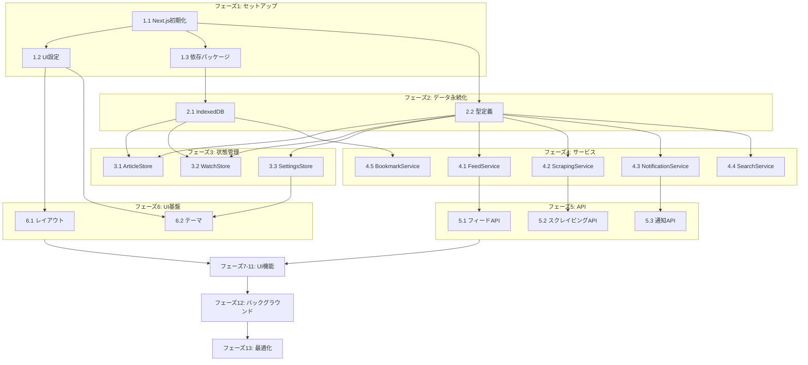

# 実装タスク: Tech Info Dashboard

## 概要
本ドキュメントは、Tech Info Dashboardの実装タスクを定義する。タスクは依存関係を考慮し、段階的に実装できるよう構成されている。

---

## フェーズ 1: プロジェクトセットアップ

### タスク 1.1: Next.js プロジェクト初期化
**要件**: 基盤  
**依存**: なし  
**見積**: 1時間

#### 実装内容
- [ ] Next.js 14 (App Router) プロジェクト作成
- [ ] TypeScript 設定
- [ ] ESLint / Prettier 設定
- [ ] パス エイリアス設定 (`@/`)

#### 受け入れ基準
- `npm run dev` で開発サーバーが起動する
- TypeScript の strict モードが有効
- Lint エラーがない状態

#### 参照
- design.md: 技術スタック

---

### タスク 1.2: UI ライブラリ・スタイリング設定
**要件**: 基盤  
**依存**: 1.1  
**見積**: 1時間

#### 実装内容
- [ ] Tailwind CSS インストール・設定
- [ ] shadcn/ui 初期化
- [ ] 基本コンポーネント追加 (Button, Card, Input, Dialog, Toast)
- [ ] カラーテーマ設定（ライト/ダーク）
- [ ] グローバルスタイル設定

#### 受け入れ基準
- shadcn/ui コンポーネントが正常にレンダリングされる
- ダークモード切り替えが動作する

#### 参照
- design.md: 技術スタック (shadcn/ui, Tailwind CSS)

---

### タスク 1.3: 依存パッケージインストール
**要件**: 基盤  
**依存**: 1.1  
**見積**: 30分

#### 実装内容
- [ ] 状態管理: `zustand`
- [ ] データ永続化: `dexie`
- [ ] 検索: `fuse.js`
- [ ] フィードパース: `rss-parser`
- [ ] スクレイピング: `cheerio`, `jsdom`
- [ ] 差分検出: `diff-match-patch`
- [ ] スケジューラ: `node-cron`
- [ ] robots.txt: `robots-parser`
- [ ] ユーティリティ: `nanoid`, `date-fns`

#### 受け入れ基準
- 全パッケージがインストールされ、import可能

---

## フェーズ 2: データ永続化レイヤー

### タスク 2.1: IndexedDB スキーマ定義（Dexie.js）
**要件**: 全要件の基盤  
**依存**: 1.3  
**見積**: 1.5時間

#### 実装内容
- [ ] `lib/db/index.ts` - Dexie インスタンス作成
- [ ] テーブル定義:
  - `feeds`: FeedSource
  - `articles`: Article
  - `bookmarks`: Bookmark
  - `watchedPages`: WatchedPage
  - `snapshots`: PageSnapshot
  - `changes`: PageChange
- [ ] インデックス設定
- [ ] 型定義 (`lib/db/types.ts`)

#### 受け入れ基準
- 各テーブルへのCRUD操作が可能
- ブラウザのIndexedDBにデータが永続化される

#### 参照
- design.md: データモデル、論理データモデル

---

### タスク 2.2: 共通型定義
**要件**: 全要件の基盤  
**依存**: 1.1  
**見積**: 1時間

#### 実装内容
- [ ] `types/feed.ts` - FeedSource, Article
- [ ] `types/bookmark.ts` - Bookmark
- [ ] `types/watch.ts` - WatchedPage, PageSnapshot, PageChange, DiffResult
- [ ] `types/settings.ts` - Settings, NotificationSettings
- [ ] `types/common.ts` - Result型, エラー型

#### 受け入れ基準
- 全インターフェースが定義され、型チェックが通る

#### 参照
- design.md: サービスインターフェース

---

## フェーズ 3: 状態管理レイヤー

### タスク 3.1: ArticleStore 実装
**要件**: 2.2, 2.5, 3.1, 3.4, 4.2-4.4  
**依存**: 2.1, 2.2  
**見積**: 2時間

#### 実装内容
- [ ] `store/article-store.ts` - Zustand ストア
- [ ] 状態: articles, feeds, filters, isLoading, lastSyncAt
- [ ] アクション: setArticles, addFeed, removeFeed, updateFilters, syncFeeds, getFilteredArticles
- [ ] IndexedDB との自動同期（persist middleware）
- [ ] 重複検出ロジック

#### 受け入れ基準
- 記事・フィードの追加/削除が状態に反映される
- フィルタリングが正しく動作する
- ページリロード後もデータが保持される

#### 参照
- design.md: ArticleStore

---

### タスク 3.2: WatchStore 実装
**要件**: 7.1-7.4  
**依存**: 2.1, 2.2  
**見積**: 2時間

#### 実装内容
- [ ] `store/watch-store.ts` - Zustand ストア
- [ ] 状態: watchedPages, snapshots, changes, unreadChangeCount, isLoading
- [ ] アクション: addWatchedPage, removeWatchedPage, updateWatchedPage, pauseWatch, resumeWatch
- [ ] スナップショット管理: addSnapshot, getSnapshots
- [ ] 変更管理: addChange, markChangeAsRead, markAllChangesAsRead, getUnreadChanges
- [ ] IndexedDB との自動同期
- [ ] 古いスナップショットの自動削除（10件超過時）

#### 受け入れ基準
- 監視ページの追加/削除/更新が状態に反映される
- 変更の未読カウントが正しく計算される
- ページリロード後もデータが保持される

#### 参照
- design.md: WatchStore

---

### タスク 3.3: SettingsStore 実装
**要件**: 6.1-6.5  
**依存**: 2.2  
**見積**: 1時間

#### 実装内容
- [ ] `store/settings-store.ts` - Zustand ストア
- [ ] 状態: theme, layout, syncInterval, priorityFeeds, notifications
- [ ] アクション: get, update, reset
- [ ] localStorage への永続化

#### 受け入れ基準
- 設定の変更が即座に反映される
- ページリロード後も設定が保持される

#### 参照
- design.md: SettingsService

---

## フェーズ 4: サービスレイヤー

### タスク 4.1: FeedService 実装
**要件**: 1.1-1.5, 2.1-2.4  
**依存**: 2.2  
**見積**: 3時間

#### 実装内容
- [ ] `services/feed-service.ts`
- [ ] `detectFeedType(url)` - フィード形式自動検出
- [ ] `fetchFeed(source)` - フィード取得・パース
- [ ] `validateUrl(url)` - URL検証
- [ ] RSS 2.0 / Atom / JSON Feed 対応
- [ ] 記事の正規化ロジック
- [ ] Result型によるエラーハンドリング

#### 受け入れ基準
- 各フィード形式のパースが正常に動作
- 無効なURLでは適切なエラーが返る
- 記事が共通フォーマットに正規化される

#### 参照
- design.md: FeedService

---

### タスク 4.2: ScrapingService 実装
**要件**: 7.1-7.6  
**依存**: 2.2  
**見積**: 4時間

#### 実装内容
- [ ] `services/scraping-service.ts`
- [ ] `analyzePageStructure(url)` - ページ構造解析、セクション候補抽出
- [ ] `scrape(page)` - CSSセレクタ/XPathによるコンテンツ抽出
- [ ] `compareSnapshots(previous, current)` - diff-match-patchによる差分検出
- [ ] `checkRobotsTxt(url)` - robots.txt確認
- [ ] SSRF対策（プライベートIP拒否）
- [ ] レート制限（同一ドメイン1秒間隔）

#### 受け入れ基準
- ページ構造解析でセクション候補が返る
- セレクタ指定でコンテンツが正しく抽出される
- 差分が正しく検出される
- robots.txtが正しく解析される

#### 参照
- design.md: ScrapingService

---

### タスク 4.3: NotificationService 実装
**要件**: 7.3, 7.7  
**依存**: 2.2, 3.3  
**見積**: 2時間

#### 実装内容
- [ ] `services/notification-service.ts`
- [ ] `requestPermission()` - ブラウザ通知権限リクエスト
- [ ] `sendBrowserNotification(payload)` - ブラウザ通知送信
- [ ] `sendEmailNotification(email, payload)` - メール通知送信（Resend）
- [ ] `getSettings()` / `updateSettings()` - 通知設定管理
- [ ] Quiet Hours 対応

#### 受け入れ基準
- ブラウザ通知が表示される
- 通知クリックで該当ページに遷移する
- 設定に応じて通知が制御される

#### 参照
- design.md: NotificationService

---

### タスク 4.4: SearchService 実装
**要件**: 4.1, 4.5  
**依存**: 2.2  
**見積**: 1.5時間

#### 実装内容
- [ ] `services/search-service.ts`
- [ ] `search(query, articles, options)` - Fuse.jsによるあいまい検索
- [ ] `buildIndex(articles)` - 検索インデックス構築
- [ ] 検索オプション（keys, threshold, limit）
- [ ] マッチ位置のハイライト情報

#### 受け入れ基準
- キーワード検索で関連記事が返る
- あいまいマッチングが動作する
- 検索応答が100ms以内

#### 参照
- design.md: SearchService

---

### タスク 4.5: BookmarkService 実装
**要件**: 5.1-5.5  
**依存**: 2.1, 2.2  
**見積**: 1.5時間

#### 実装内容
- [ ] `services/bookmark-service.ts`
- [ ] `add(article)` - ブックマーク追加
- [ ] `remove(bookmarkId)` - ブックマーク削除
- [ ] `getAll()` - 全ブックマーク取得
- [ ] `isBookmarked(articleId)` - ブックマーク状態確認
- [ ] `updateStatus(bookmarkId, status)` - ステータス更新

#### 受け入れ基準
- ブックマークの追加/削除が動作する
- IndexedDBに永続化される

#### 参照
- design.md: BookmarkService

---

## フェーズ 5: API レイヤー

### タスク 5.1: フィード API 実装
**要件**: 1.1-1.5, 2.1-2.5  
**依存**: 4.1  
**見積**: 2時間

#### 実装内容
- [ ] `app/api/feeds/route.ts` - フィード一覧取得
- [ ] `app/api/feeds/sync/route.ts` - フィード同期（POST）
- [ ] `app/api/feeds/detect/route.ts` - フィード形式検出
- [ ] `app/api/feeds/validate/route.ts` - URL検証

#### 受け入れ基準
- API経由でフィード取得・同期が動作する
- エラー時は適切なHTTPステータスとメッセージが返る

---

### タスク 5.2: スクレイピング API 実装
**要件**: 7.1-7.6  
**依存**: 4.2  
**見積**: 2.5時間

#### 実装内容
- [ ] `app/api/watch/analyze/route.ts` - ページ構造解析
- [ ] `app/api/watch/register/route.ts` - 監視登録
- [ ] `app/api/watch/check/route.ts` - 手動チェック実行
- [ ] `app/api/watch/robots/route.ts` - robots.txt確認

#### 受け入れ基準
- ページ構造解析でセクション候補が返る
- 監視登録が正常に動作する
- robots.txt警告が適切に返る

---

### タスク 5.3: 通知 API 実装
**要件**: 7.7  
**依存**: 4.3  
**見積**: 1.5時間

#### 実装内容
- [ ] `app/api/notifications/email/route.ts` - メール通知送信
- [ ] `app/api/notifications/test/route.ts` - テスト通知送信

#### 受け入れ基準
- メール通知が送信される
- テスト通知が動作する

---

## フェーズ 6: UI レイヤー - 基本構造

### タスク 6.1: レイアウト・ナビゲーション
**要件**: 3.1-3.5  
**依存**: 1.2  
**見積**: 2時間

#### 実装内容
- [ ] `app/layout.tsx` - ルートレイアウト
- [ ] `components/layout/header.tsx` - ヘッダー（ロゴ、検索、設定）
- [ ] `components/layout/sidebar.tsx` - サイドバー（ナビゲーション、フィルタ）
- [ ] `components/layout/main-content.tsx` - メインコンテンツエリア
- [ ] レスポンシブ対応（モバイル/タブレット/デスクトップ）

#### 受け入れ基準
- 全画面サイズで適切にレイアウトされる
- ナビゲーションが動作する

---

### タスク 6.2: テーマプロバイダー
**要件**: 6.2  
**依存**: 1.2, 3.3  
**見積**: 1時間

#### 実装内容
- [ ] `components/providers/theme-provider.tsx`
- [ ] システム設定連動
- [ ] ライト/ダーク切り替え
- [ ] 設定との同期

#### 受け入れ基準
- テーマ切り替えが即座に反映される
- システム設定に追従する

---

## フェーズ 7: UI レイヤー - フィード機能

### タスク 7.1: フィード登録フォーム
**要件**: 1.1-1.4  
**依存**: 5.1, 6.1  
**見積**: 2時間

#### 実装内容
- [ ] `components/feed/feed-form.tsx`
- [ ] URL入力フィールド
- [ ] フィード形式自動検出表示
- [ ] 登録ボタン
- [ ] バリデーション・エラー表示

#### 受け入れ基準
- URL入力でフィード形式が自動検出される
- 登録成功でフィードリストに追加される
- 無効なURLでエラーが表示される

---

### タスク 7.2: フィードリスト・管理
**要件**: 1.1-1.5  
**依存**: 3.1, 7.1  
**見積**: 2時間

#### 実装内容
- [ ] `components/feed/feed-list.tsx`
- [ ] `components/feed/feed-item.tsx`
- [ ] ステータスインジケーター（アクティブ/エラー/停止）
- [ ] 削除ボタン（確認ダイアログ）
- [ ] 最終取得日時表示

#### 受け入れ基準
- 登録フィードが一覧表示される
- 削除操作が動作する
- ステータスが正しく表示される

---

### タスク 7.3: 記事一覧（タイムライン）
**要件**: 3.1-3.4  
**依存**: 3.1, 6.1  
**見積**: 3時間

#### 実装内容
- [ ] `components/article/article-list.tsx`
- [ ] `components/article/article-card.tsx`
- [ ] タイトル、ソース名、公開日時、サマリー表示
- [ ] 仮想スクロール（react-window）
- [ ] 無限スクロール or ページネーション
- [ ] レイアウト切り替え（カード/リスト/コンパクト）

#### 受け入れ基準
- 記事がタイムライン形式で表示される
- スクロールパフォーマンスが良好（1000記事でも滑らか）
- レイアウト切り替えが動作する

---

### タスク 7.4: 記事詳細・外部リンク
**要件**: 3.2  
**依存**: 7.3  
**見積**: 1.5時間

#### 実装内容
- [ ] `components/article/article-detail.tsx`
- [ ] 記事全文表示（利用可能な場合）
- [ ] 元記事への外部リンク
- [ ] 画像の遅延読み込み

#### 受け入れ基準
- 記事クリックで詳細が表示される
- 外部リンクが新しいタブで開く

---

## フェーズ 8: UI レイヤー - 検索・フィルタ

### タスク 8.1: 検索バー
**要件**: 4.1  
**依存**: 4.4, 6.1  
**見積**: 1.5時間

#### 実装内容
- [ ] `components/search/search-bar.tsx`
- [ ] キーワード入力
- [ ] デバウンス処理
- [ ] 検索結果ハイライト

#### 受け入れ基準
- キーワード入力で即座に検索結果が反映される
- 検索応答が100ms以内

---

### タスク 8.2: フィルタパネル
**要件**: 4.2-4.5  
**依存**: 3.1, 6.1  
**見積**: 2時間

#### 実装内容
- [ ] `components/filter/filter-panel.tsx`
- [ ] ソースフィルタ（チェックボックス）
- [ ] カテゴリ/タグフィルタ
- [ ] 日付範囲フィルタ
- [ ] フィルタクリアボタン
- [ ] 複合フィルタ対応

#### 受け入れ基準
- 各フィルタが正しく動作する
- 複数フィルタの組み合わせが動作する

---

## フェーズ 9: UI レイヤー - ブックマーク

### タスク 9.1: ブックマークボタン
**要件**: 5.1, 5.2, 5.4  
**依存**: 4.5, 7.3  
**見積**: 1時間

#### 実装内容
- [ ] `components/bookmark/bookmark-button.tsx`
- [ ] ブックマーク状態表示（アイコン変化）
- [ ] クリックでトグル
- [ ] 楽観的更新

#### 受け入れ基準
- ブックマーク追加/削除が即座に反映される
- 状態がアイコンで明確に表示される

---

### タスク 9.2: ブックマーク一覧
**要件**: 5.3, 5.5  
**依存**: 4.5, 6.1  
**見積**: 1.5時間

#### 実装内容
- [ ] `components/bookmark/bookmark-list.tsx`
- [ ] ブックマーク済み記事一覧
- [ ] 「元記事削除」ステータス表示
- [ ] ブックマーク解除ボタン

#### 受け入れ基準
- ブックマーク済み記事が一覧表示される
- 削除された元記事のステータスが表示される

---

## フェーズ 10: UI レイヤー - Webスクレイピング機能

### タスク 10.1: 監視ページ登録フォーム
**要件**: 7.1, 7.5, 7.6  
**依存**: 5.2, 6.1  
**見積**: 3時間

#### 実装内容
- [ ] `components/watch/watch-form.tsx`
- [ ] URL入力フィールド
- [ ] ページ構造解析トリガー
- [ ] セクション選択UI（ラジオボタン/チェックボックス）
- [ ] CSSセレクタ/XPath手動入力オプション
- [ ] 監視間隔設定
- [ ] robots.txt警告表示・確認ダイアログ

#### 受け入れ基準
- URL入力でページ構造が解析される
- セクション選択で監視範囲を指定できる
- robots.txt警告が適切に表示される

---

### タスク 10.2: 監視ページ一覧
**要件**: 7.1-7.3  
**依存**: 3.2, 6.1  
**見積**: 2時間

#### 実装内容
- [ ] `components/watch/watch-list.tsx`
- [ ] `components/watch/watch-item.tsx`
- [ ] ステータスインジケーター（アクティブ/エラー/停止）
- [ ] 最終チェック日時、最終変更日時
- [ ] 一時停止/再開ボタン
- [ ] 削除ボタン（確認ダイアログ）
- [ ] 手動チェックボタン

#### 受け入れ基準
- 監視ページが一覧表示される
- 各操作が正常に動作する
- ステータスが正しく表示される

---

### タスク 10.3: 変更通知バッジ・リスト
**要件**: 7.3  
**依存**: 3.2, 6.1  
**見積**: 1.5時間

#### 実装内容
- [ ] `components/watch/change-badge.tsx` - ヘッダーの未読バッジ
- [ ] `components/watch/change-list.tsx` - 変更一覧
- [ ] 未読/既読管理
- [ ] 全て既読にする機能

#### 受け入れ基準
- 未読変更がバッジで表示される
- 変更クリックで既読になる

---

### タスク 10.4: 差分ビューア
**要件**: 7.4  
**依存**: 3.2, 6.1  
**見積**: 2.5時間

#### 実装内容
- [ ] `components/watch/diff-viewer.tsx`
- [ ] 変更前後のコンテンツ表示
- [ ] 差分ハイライト（追加: 緑、削除: 赤）
- [ ] インラインdiff / サイドバイサイド表示切替
- [ ] 変更履歴タイムライン
- [ ] 特定スナップショット間の比較

#### 受け入れ基準
- 差分が視覚的に分かりやすく表示される
- 過去の変更履歴を確認できる

---

## フェーズ 11: UI レイヤー - 設定

### タスク 11.1: 設定パネル
**要件**: 6.1-6.5, 7.7  
**依存**: 3.3, 4.3, 6.1  
**見積**: 2時間

#### 実装内容
- [ ] `components/settings/settings-panel.tsx`
- [ ] テーマ設定（ライト/ダーク/システム）
- [ ] レイアウト設定（カード/リスト/コンパクト）
- [ ] 同期間隔設定
- [ ] 優先フィード設定
- [ ] 通知設定（ブラウザ/メール）
- [ ] メールアドレス入力
- [ ] 設定リセットボタン

#### 受け入れ基準
- 各設定の変更が即座に反映される
- 設定がリロード後も保持される

---

## フェーズ 12: 定期実行・バックグラウンド処理

### タスク 12.1: フィード自動同期
**要件**: 2.1, 2.2  
**依存**: 3.1, 5.1  
**見積**: 1.5時間

#### 実装内容
- [ ] アプリ起動時の自動同期
- [ ] 設定間隔での定期同期（setInterval）
- [ ] バックグラウンドでの実行
- [ ] 同期中インジケーター

#### 受け入れ基準
- 起動時に自動で最新情報を取得
- 設定間隔で定期的に同期される

---

### タスク 12.2: スクレイピング定期実行
**要件**: 7.2  
**依存**: 3.2, 5.2, 4.3  
**見積**: 2時間

#### 実装内容
- [ ] 監視ページごとの定期チェック
- [ ] 変更検出時の通知トリガー
- [ ] エラー時のリトライロジック
- [ ] 最終チェック日時の更新

#### 受け入れ基準
- 設定間隔で定期的にスクレイピングが実行される
- 変更検出時に通知が送信される

---

## フェーズ 13: 最適化・品質向上

### タスク 13.1: パフォーマンス最適化
**要件**: パフォーマンス目標  
**依存**: フェーズ7-12  
**見積**: 2時間

#### 実装内容
- [ ] 仮想スクロールの調整
- [ ] 検索インデックスのメモ化
- [ ] 画像の遅延読み込み最適化
- [ ] バンドルサイズ分析・最適化

#### 受け入れ基準
- LCP < 3秒
- 検索応答 < 100ms
- スクレイピング < 10秒/ページ

---

### タスク 13.2: エラーハンドリング・UX改善
**要件**: 全要件  
**依存**: フェーズ7-12  
**見積**: 2時間

#### 実装内容
- [ ] グローバルエラーバウンダリ
- [ ] トースト通知の統一
- [ ] ローディング状態の改善
- [ ] オフライン対応の強化

#### 受け入れ基準
- エラー時にユーザーフレンドリーなメッセージが表示される
- ローディング中の状態が明確

---

### タスク 13.3: アクセシビリティ対応
**要件**: 全UI  
**依存**: フェーズ6-11  
**見積**: 1.5時間

#### 実装内容
- [ ] キーボードナビゲーション
- [ ] ARIA属性の追加
- [ ] フォーカス管理
- [ ] スクリーンリーダー対応

#### 受け入れ基準
- キーボードのみで全操作が可能
- スクリーンリーダーで適切に読み上げられる

---

## タスク依存関係図

---

## 見積サマリ

| フェーズ | タスク数 | 見積時間 |
|---------|---------|---------|
| 1. セットアップ | 3 | 2.5時間 |
| 2. データ永続化 | 2 | 2.5時間 |
| 3. 状態管理 | 3 | 5時間 |
| 4. サービス | 5 | 12時間 |
| 5. API | 3 | 6時間 |
| 6. UI基盤 | 2 | 3時間 |
| 7. フィード機能 | 4 | 8.5時間 |
| 8. 検索・フィルタ | 2 | 3.5時間 |
| 9. ブックマーク | 2 | 2.5時間 |
| 10. スクレイピング機能 | 4 | 9時間 |
| 11. 設定 | 1 | 2時間 |
| 12. バックグラウンド | 2 | 3.5時間 |
| 13. 最適化 | 3 | 5.5時間 |
| **合計** | **36** | **約65時間** |

